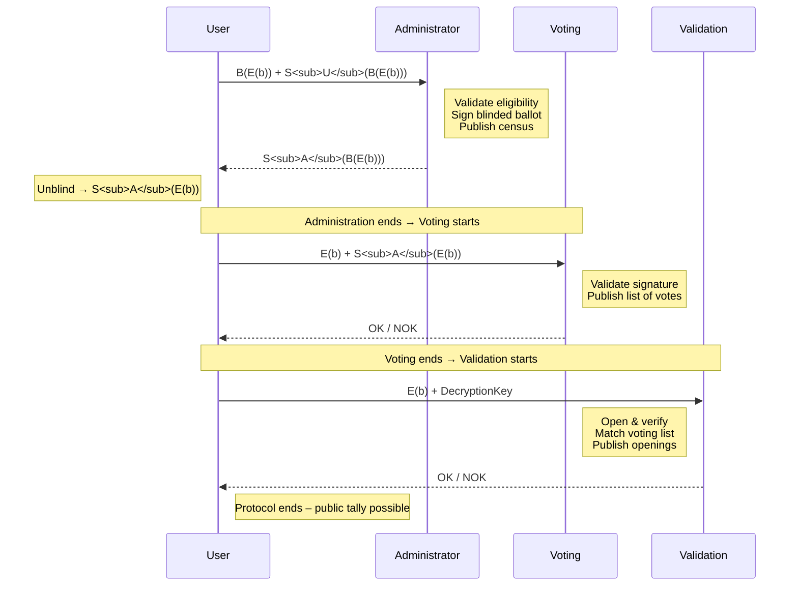

# A Simple eVoting Scheme

​		Fernando Alonso Vendrell

​		(July 14th 2019)


I propose a simple eVoting Scheme based on voting scheme of Fujioka, Okamoto and Ohta [FOO] which is usually referred as the FOO voting scheme, in which the sessions order is modified providing means to reduce the DoS attacks during the anonymous communications.

[TOC]

## Definitions

- **Ballot**: A digital message that represents a decision made by the voter, represented by **b**.
- **Nonce**: A non-deterministic random digital message, represented by **n**.  
  https://en.wikipedia.org/wiki/Cryptographic_nonce
- **Signature / Digital Signature**: A digital message appended to an original message that can only be created by the signer but can be verified by anyone.  
  https://en.wikipedia.org/wiki/Digital_signature. Represented by **S(·)**.
- **Encryption / Decryption – Blind / Unblind**: Represented by **B(·)** and **U(·)** so that U(B(m)) = m.  
  Also written **E(·)** and **D(·)**.  
  https://en.wikipedia.org/wiki/Encryption
- **Blind Signature**: A signing algorithm applied to a blinded message; after unblinding, a valid signature on the original message is obtained.  
  https://en.wikipedia.org/wiki/Blind_signature. Also represented by **S(·)**.
- **Hash**: Represented by **H(·)**.  
  https://en.wikipedia.org/wiki/Cryptographic_hash_function

## FOO scheme

The FOO scheme contains 3 sessions, **Administration**, **Voting** and **Validation** (assumed non overlapping to difficult voter-vote correlation)

### Administration setup

The voter prepares the ballot **b** 

**message=m=b**

Then the voter blinds that message and sends them to the administrator in a predefined format which includes signature of voter for validation:

**B(E(b))+S<sub>U</sub>(B(E(b)))**

The administrator signs the message and returns it back to the voter

**S<sub>A</sub>(B(E(b)))**

The voter applies unblinding thus obtaining the original message and its has signed by administrator

**S<sub>A</sub>(E(b))**

### Voting

After administration phase is completed the user sends the encrypted ballot together with the administrator signature via anonymous channel the the voting storage

**E(b)+S<sub>A</sub>(E(b))**

The voting storage or network intermediates can check signature and message format, if signature  or format fails the entry is not accepted, if entry succeeds the validation storage can return signed acknowledge and adds the entry to the list, the list is shown to the public and can add additional info provided by the voting storage.

- Anyone can check that the signature is correct
- The user can check that its vote has been accounted
- Anyone can check that the number of votes is less or equal than the number of users

### Validation 

After voting phase is completed the user sends the encrypted ballot and the key to decrypt it

**E(b)+DecryptionKey** so that anyone can obtain **D(E(b))=b**

- Anyone can check that the decryption is correct
- The user can check that its vote (encrypted) has been accounted
- Anyone can check that the number of validations is less or equal than the number of voters
- Anyone can count votes and get to final result



## Simple eVoting Scheme

Simple eVoting scheme is made of 3 non overlapping sessions, Administration, Validation and Voting.

### Administration setup

The user prepares the ballot **b** together with a nonce **n** and concatenates them via a give structure **+**

   **message(m)=b+n**

it also computes a hash of the message

   **hash(h)=H(b+n)**

Then the user blinds both messages and sends them to the administrator in a predefined format which includes signature of user for validation:

**B(m)=B(b+n) => B(m)+S(B(m))**

**B(h)=B(H(b+n)) => B(h)+S<sub>U</sub>(B(h))**

The administrator signs both messages and returns them back to the user, adds received data plus user identity to table

**S<sub>A</sub>(B(m))**

**S<sub>A</sub>(B(h))**

The user applies unblinding thus obtaining the original message and its has signed by administrator

**S<sub>A</sub>(m)**

**S<sub>A</sub>(h)**

### Validation 

After administration phase is completed the user sends the hash together with the administrator signature via a anonymous channel to the validation storage

**h+s(h)**

The validation storage or network intermediates can check signature and message format, if signature  or format fails the entry is not accepted, if entry succeeds the validation storage can return signed acknowledge and adds the entry to the list, the list is shown to the public and can add additional info provided by the validation storage.

- Anyone can check that the signature is correct
- The user can check that its validation has been accounted
- Anyone can check that the number of validations is less or equal than the number of users

### Voting

After validation phase is completed the user send the message=ballot+nonce together with the administrator signature via anonymous channel the the voting storage

**m+S(m)=b+n+S(b+n)**

the voting storage or network intermediates can check signature, message format and hash validation,  if signature, format or hash fails the entry is not accepted. If entry succeeds the voting storage can return signed acknowledge and adds the entry to the list, the list is shown to the public and can add additional info provided by the voting storage.

- Anyone can check that the signature is correct
- The user can check that its vote has been accounted
- Anyone can check that the number of votes is less or equal than the number of users
- Anyone can check that the hash of the message is present in the validation storage.
- Anyone can count votes and get to final result


```sequence
User->Administrator: B(b+n)+B(H(b+n))
Note right of Administrator: Validate user can vote, \n sign both
Note right of Administrator: Made list of census public
Administrator-->User: S(B(b+n))+S(B(H(b+n)))
Note left of User: User can obtain then:\n S(b+n) and S(H(b+n))
Note right of User: Once Administrator phase ends \nValidation can get started
User->Validator: H(b+n)+S(H(b+n))
Note right of Validator: Validate signature. \n List of validations public
Validator-->User: OK/NOK
Note right of User: Once Validation phase ends \Voting can get started
User->Voting: b+n+S(b+n)
Note left of Voting: Validate signature. \n Validate with validation list.\n List of votings public
Voting-->User: OK/NOK
Note right of User: End of Voting.
```


## Differences in comparison to FOO scheme

### All the anonymous communications comes signed by Administration

Facilitates early filtering of anonymous requests helping in DDoS attacks. As in FOO scheme all messages in the validation phase have to be checked first if encrypted vote is present and then for decryption.

### Validation depends on hash rather than encryption/decryption.

Assuming blind/unblind are the same strength in the Administrator communication, Strength depends on nonce and hash rather than encryption key. Hash is agreed before the voting starts, therefore validation effort is fixed. Nonce length can be also agreed to maximize security to a given ballot and hash.

### Vote is provided in the 3rd session instead of the 2nd one

Voter can decide not to share the vote right until the last moment while in FOO scheme that is done is 2nd phase (voting), even though encrypted and can be suitable for later attacks.

## References

[FOO]: https://link.springer.com/book/10.1007/3-540-57220-1	"Fujioka, A., T. Okamoto and K. Ohta, A practical secret voting scheme for large scale elections,in:   J. Seberry and Y. Zheng, editors, Advances in Cryptology – AUSCRYPT’92 (1992)"